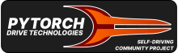

# 

A PyTorch library for training BEV style perception models for self driving
tasks. This is unaffiliated with the PyTorch project. This currently includes
helpful primitives needed to put together a model.

## Install from Source

```
$ git clone https://github.com/d4l3k/torchdrive.git
$ cd torchdrive
$ pip install -e .
```

## Background

I've been documenting the process for this code. Please see my blog at
https://fn.lc/post/3d-detr/ for more details.

## Data Access

The training dataset for this repo has been collected from my car and thus has
lots of personally identifying information so I'm not willing to make it public
at this time. If you're interested in contributing or collaborating feel free to
reach out. I'm happy to test changes on my own hardware and there may be other
options too.

## Contact

If you have any questions or concerns, please reach out to me either by filing
an issue or emailing me at [rice@fn.lc](mailto:rice@fn.lc).

## License

This project is a hobby project and done in my free time. This is non-commercial
and no profit has been made from this work.

See the [LICENSE](LICENSE) file for more information. Some files and functions
have different licenses and are marked accordingly.
